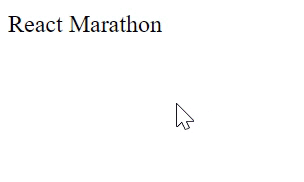

# React online marathon

## The tasks of the topics "State" and "Events"

There is the component App

Write code to provide:

1. Using the property <code>appData</code> of <code>state</code> the component <code>App</code> renders one element <code>div</code> with text <code>React Marathon</code> in it

2. If you click mouse on this <code>div</code> element the component <code>App</code> will convert the value of property <code>appData</code> to lowercase
### Example

